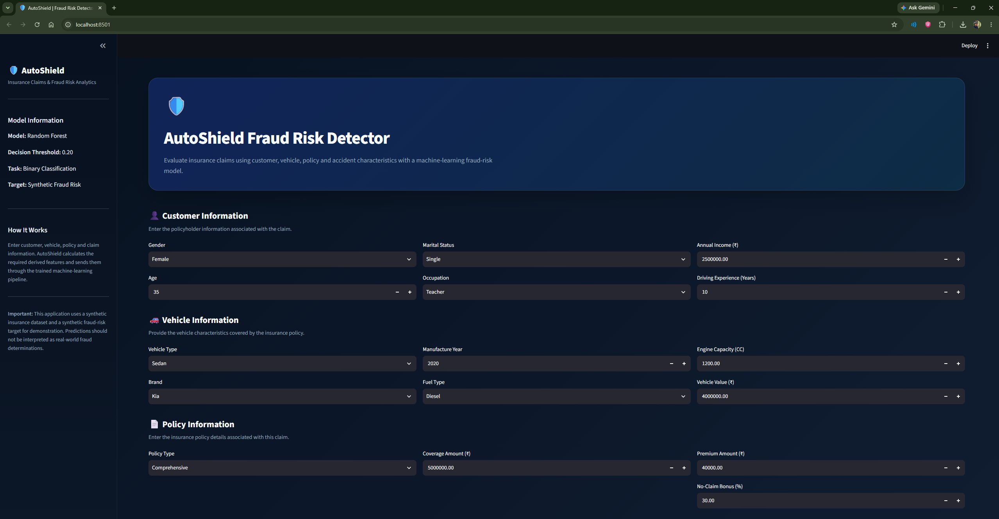
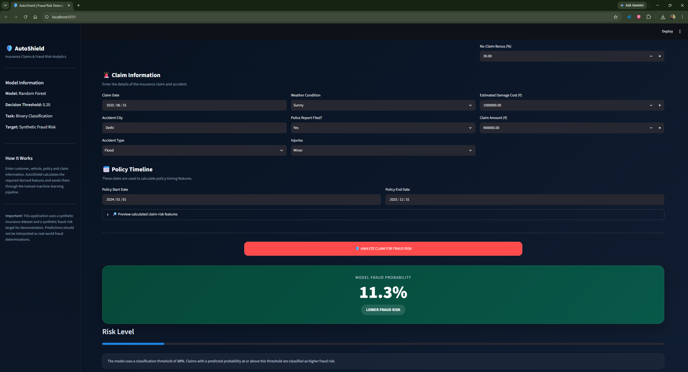
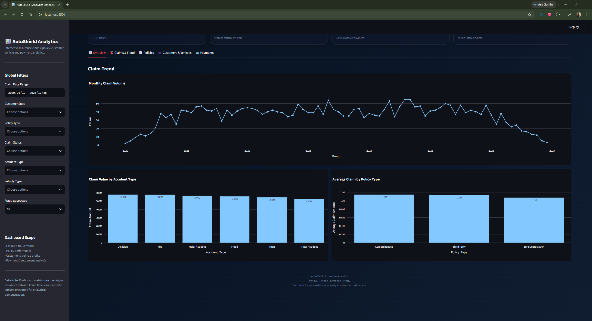
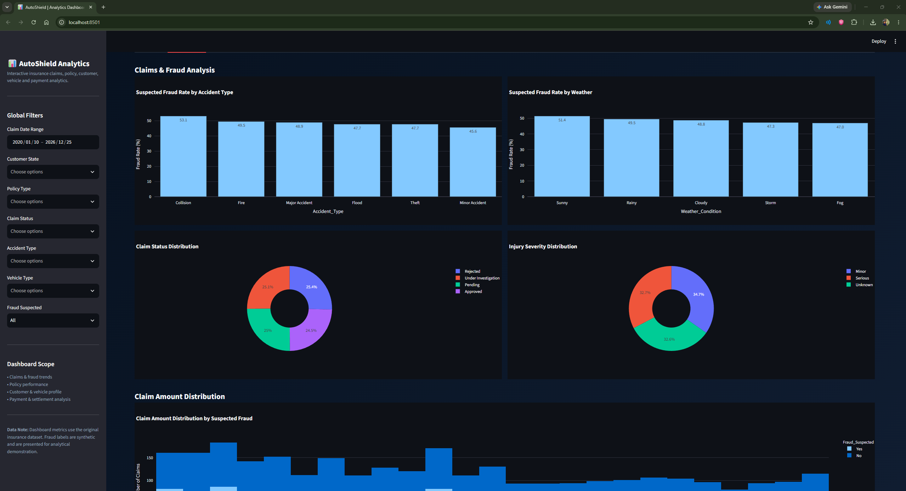
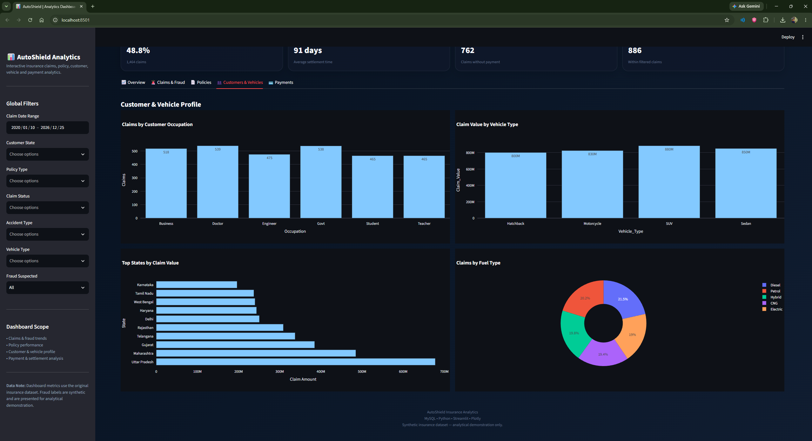
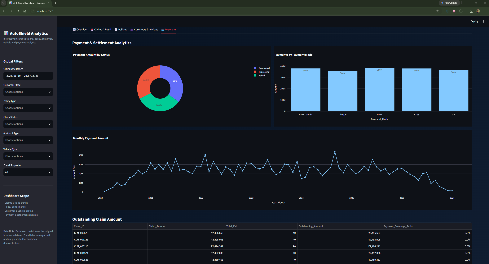
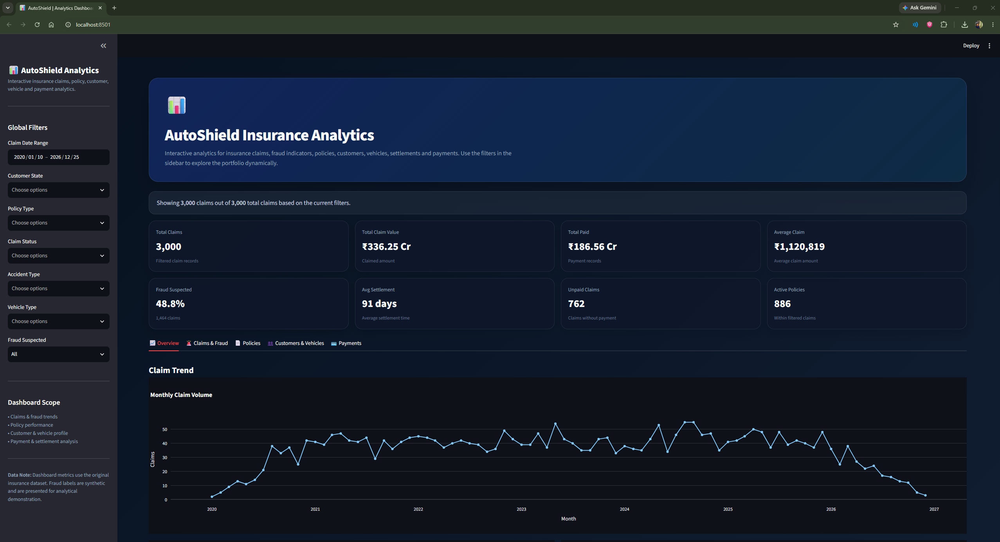

# 🛡️ AutoShield — Insurance Claims & Fraud Risk Analytics

> **An end-to-end insurance analytics platform built with MySQL, Python, Streamlit, and Machine Learning for analyzing customers, vehicles, policies, claims, payments, and fraud risk.**

---

## 📌 Project Overview

**AutoShield** is a complete insurance analytics project designed to demonstrate an end-to-end data workflow from raw data ingestion to interactive business analytics and machine-learning-based fraud-risk prediction.

The project works with five interconnected insurance datasets:

- Customers
- Vehicles
- Policies
- Claims
- Payments

The workflow covers database design, raw-data loading, SQL auditing, Python-based data cleaning, feature engineering, fraud-risk modeling, model evaluation, and two Streamlit applications:

1. **AutoShield Fraud Risk Detector** — predicts synthetic fraud risk for an individual claim.
2. **AutoShield Insurance Analytics Dashboard** — provides interactive business analysis across claims, fraud indicators, policies, customers, vehicles, payments, and settlements.

A Power BI dashboard is planned as the next visualization layer using the finalized analytical dataset.

> **Dataset note:** The project uses synthetic insurance data. The fraud-prediction target is also synthetic and is intended to demonstrate an end-to-end machine-learning workflow rather than represent a production fraud-detection system.

---

## 🎯 Project Objectives

The main objectives of AutoShield are to:

- Build a relational MySQL database for insurance operations.
- Load and validate raw insurance data.
- Perform comprehensive SQL data-quality auditing.
- Clean and validate the data using Python/Jupyter.
- Engineer insurance-specific analytical and modeling features.
- Analyze claim, policy, customer, vehicle, and payment behavior.
- Develop a fraud-risk classification workflow.
- Compare multiple machine-learning algorithms.
- Build an interactive Streamlit fraud prediction application.
- Build an interactive Streamlit insurance analytics dashboard.
- Prepare the project for a future Power BI reporting layer.

---

# 🏗️ End-to-End Architecture

```text
                          ┌─────────────────────┐
                          │      Excel Files    │
                          │ Customers / Vehicles│
                          │ Policies / Claims   │
                          │ Payments            │
                          └──────────┬──────────┘
                                     │
                                     ▼
                          ┌─────────────────────┐
                          │   Python ETL Loader │
                          │   01_load_data.py   │
                          └──────────┬──────────┘
                                     │
                                     ▼
                    ┌────────────────────────────────┐
                    │          MySQL Database         │
                    │                                │
                    │ Customers → Vehicles           │
                    │ Customers → Policies           │
                    │ Policies  → Claims             │
                    │ Claims    → Payments           │
                    └────────────────┬───────────────┘
                                     │
                       ┌─────────────┴──────────────┐
                       │                            │
                       ▼                            ▼
              ┌─────────────────┐          ┌─────────────────┐
              │ SQL Data Audit  │          │ Python Cleaning │
              │ & Validation    │          │ & Feature Eng.  │
              └─────────────────┘          └────────┬────────┘
                                                    │
                         ┌──────────────────────────┴────────────────────────┐
                         │                                                   │
                         ▼                                                   ▼
              ┌─────────────────────┐                         ┌─────────────────────┐
              │ Insurance Analytics │                         │ Fraud ML Pipeline   │
              │ Dataset             │                         │                     │
              └──────────┬──────────┘                         └──────────┬──────────┘
                         │                                               │
                         ▼                                               ▼
              ┌─────────────────────┐                         ┌─────────────────────┐
              │ Streamlit Analytics │                         │ Fraud Risk Detector │
              │ Dashboard           │                         │ Streamlit App       │
              └──────────┬──────────┘                         └─────────────────────┘
                         │
                         ▼
              ┌─────────────────────┐
              │      Power BI       │
              │   Dashboard Layer   │
              │      (Planned)      │
              └─────────────────────┘
```

---

# 🗂️ Project Structure

```text
autoshield-insurance-analytics/
│
├── data/
│   ├── Customers.xlsx
│   ├── Vehicles.xlsx
│   ├── Policies.xlsx
│   ├── Claims.xlsx
│   └── Payments.xlsx
│
├── sql/
│   ├── 01_create_database.sql
│   ├── 02_create_tables.sql
│   ├── 04_data_audit.sql
│   └── ...
│
├── python/
│   └── 01_load_data.py
│
├── notebooks/
│   └── insurance_data_cleaning.ipynb
│
├── models/
│   ├── fraud_detection_pipeline.joblib
│   ├── model_metadata.json
│   └── feature_schema.json
│
├── streamlit_app/
│   ├── app.py
│   └── dashboard.py
│
├── images/
│   ├── app_images/
│   │   ├── app_image1.png
│   │   └── app_image2_model_outcome.png
│   │
│   └── dashboard_images/
│       ├── dashboard_kpis.png
│       ├── dashboard_overview.png
│       ├── dashboard_claim_analysis.png
│       ├── dashboard_policy_analysis.png
│       ├── dashboard_customer_and_vehicle_analysis.png
│       └── dashboard_payments_analysis.png
│
├── .env
├── .gitignore
├── requirements.txt
└── README.md
```

> **Note:** Keep `.env` local and do not commit it to GitHub. The image references above assume the screenshots shown in the project folder use `.png` extensions.

---

# 📊 Dataset Description

The project uses five related synthetic datasets.

| Table | Records | Purpose |
|---|---:|---|
| Customers | 1,000 | Customer demographics, income, contact information, and driving experience |
| Vehicles | 1,200 | Vehicle ownership and vehicle characteristics |
| Policies | 1,500 | Insurance policy coverage, premiums, dates, and status |
| Claims | 3,000 | Accident, damage, fraud indicator, claim status, and settlement information |
| Payments | 2,238 | Claim-related payment transactions |

### Core relationships

```text
Customers
    │
    ├──────────► Vehicles
    │
    └──────────► Policies
                    │
                    └──────────► Claims
                                      │
                                      └──────────► Payments
```

---

# 🗄️ MySQL Database Layer

The MySQL database is named:

```text
autoshield_insurance
```

### Main tables

### `customers`

Stores policyholder information including:

- Customer ID
- Name
- Gender
- Age
- Marital status
- Occupation
- Annual income
- City and state
- Contact information
- Driving experience

### `vehicles`

Stores vehicle information including:

- Vehicle ID
- Customer ID
- Vehicle type
- Brand and model
- Manufacture year
- Registration state
- Fuel type
- Engine capacity
- Vehicle value
- Purchase date

### `policies`

Stores insurance policy information including:

- Policy ID
- Customer ID
- Vehicle ID
- Policy type
- Coverage amount
- Premium amount
- Start and end dates
- No-claim bonus
- Policy status

### `claims`

The central transactional table containing:

- Claim ID
- Policy ID
- Vehicle ID
- Customer ID
- Claim date
- Accident city/type
- Weather condition
- Police report indicator
- Injury severity
- Estimated damage
- Claim amount
- Fraud-suspected indicator
- Claim status
- Settlement duration

### `payments`

Stores claim payment transactions:

- Payment ID
- Claim ID
- Payment date
- Payment mode
- Amount paid
- Payment status

---

# 🔍 SQL Data Audit

A dedicated SQL audit was performed before Python cleaning.

The audit includes:

- Database and table inspection
- Row-count verification
- Table-structure validation
- NULL-value checks
- Duplicate primary-key checks
- Categorical-value profiling
- Numerical range checks
- Date validation
- Foreign-key integrity checks
- Cross-table consistency checks
- Claim amount validation
- Payment validation
- Claims without payment analysis
- Payment-vs-claim comparison
- Fraud distribution analysis
- Policy and claim status analysis
- Final database-quality summary

### Initial audit highlights

The raw database contained:

```text
Customers : 1,000
Vehicles  : 1,200
Policies  : 1,500
Claims    : 3,000
Payments  : 2,238
```

The audit found no duplicate primary-key values and no broken foreign-key references.

The main missing-value issue was:

```text
Claims.Injuries → 979 missing values
```

The missing injury values were handled in Python as:

```text
Minor
Serious
Unknown
```

rather than arbitrarily assigning one of the observed injury categories.

---

# 🧹 Python Data Cleaning & Validation

The notebook `insurance_data_cleaning.ipynb` performs the Python-side data-quality workflow.

### Main stages

```text
MySQL Raw Tables
       ↓
Initial Profiling
       ↓
Datatype Validation
       ↓
Missing-Value Analysis
       ↓
Duplicate Checks
       ↓
Categorical Validation
       ↓
Numerical Validation
       ↓
Date Validation
       ↓
Cross-Table Validation
       ↓
Cleaning Decisions
       ↓
Feature Engineering
       ↓
ML Dataset Preparation
```

### Important data-quality correction

During cross-table validation, 821 policy records were found where the policy start date occurred before the associated vehicle purchase date.

Because the data is synthetic and the downstream policy/claim timeline was already internally consistent, the correction was handled deterministically at the vehicle-date level rather than modifying policy or claim dates.

For affected vehicles, the corrected chronology was established as:

```text
Manufacture Year ≤ Purchase Date < Earliest Policy Start
```

The corrected values were validated again after the transformation.

---

# 🤖 Fraud Risk Modeling

## Original target investigation

The original:

```text
Fraud_Suspected
```

field was initially evaluated as the machine-learning target.

Multiple models were trained and tuned, but predictive performance remained weak, with ROC-AUC values around the random-classification range.

Further analysis showed very low mutual-information values and only small differences between fraud and non-fraud groups.

This indicated that the original synthetic fraud label contained limited learnable relationships with the available predictors.

---

# 🧠 Synthetic Fraud-Risk Target

To create a meaningful machine-learning demonstration, a secondary synthetic target was developed using observable claim and policy characteristics.

The workflow was:

```text
Insurance Features
       ↓
Risk Indicators
       ↓
Synthetic Risk Score
       ↓
Probabilistic Fraud Target
       ↓
Machine Learning
```

The probabilistic target increases fraud probability as the synthetic risk score increases while allowing overlap between fraud and non-fraud observations.

The original `Fraud_Suspected` field is preserved separately.

> This target is synthetic and exists specifically to demonstrate the modeling workflow. It should not be interpreted as a real-world fraud label.

---

# ⚙️ Feature Engineering

Insurance-specific features were created to enrich the modeling and analytics datasets.

Examples include:

### Vehicle age

```text
Vehicle_Age
```

Calculated from the vehicle manufacture year and claim year.

### Premium / Coverage Ratio

```text
Premium_Coverage_Ratio
```

Measures premium relative to the insured coverage amount.

### Claim / Damage Ratio

```text
Claim_Damage_Ratio
```

Compares the requested claim amount with the estimated damage cost.

### Claim / Vehicle Value Ratio

```text
Claim_Vehicle_Value_Ratio
```

Measures the claim relative to the vehicle's estimated value.

### Claim / Coverage Ratio

```text
Claim_Coverage_Ratio
```

Measures the claim relative to policy coverage.

### Damage / Vehicle Value Ratio

```text
Damage_Vehicle_Value_Ratio
```

Measures estimated damage relative to vehicle value.

### Claim / Income Ratio

```text
Claim_Income_Ratio
```

Compares claim value with annual customer income.

### Policy timing features

```text
Policy_Age_At_Claim
Days_To_Policy_End
```

These capture the position of the claim within the policy lifecycle.

### Temporal features

```text
Claim_Year
Claim_Month
Claim_DayOfWeek
Claim_Weekend
```

---

# 🧪 Machine Learning Pipeline

The final fraud-modeling workflow uses:

### Preprocessing

**Numerical features**

```text
StandardScaler
```

**Categorical features**

```text
OneHotEncoder
```

with:

```text
handle_unknown="ignore"
```

### Train/Test Strategy

```text
80% Training
20% Testing
```

with stratification to maintain the target-class distribution.

### Models evaluated

- Logistic Regression
- Random Forest
- Gradient Boosting
- XGBoost

### Model evaluation

The models were compared using:

- Accuracy
- Precision
- Recall
- F1-score
- ROC-AUC
- Confusion Matrix
- ROC Curve
- Precision-Recall Curve

---

# 🌲 Final Fraud Model

The deployed Streamlit predictor uses a:

```text
Random Forest Classifier
```

with the complete preprocessing pipeline stored in:

```text
models/fraud_detection_pipeline.joblib
```

Additional model metadata is stored in:

```text
models/model_metadata.json
```

and the feature structure is stored in:

```text
models/feature_schema.json
```

The selected operating threshold is:

```text
0.20
```

This threshold was selected using out-of-fold training predictions rather than using the test set directly.

The final evaluation showed approximately:

```text
ROC-AUC  : 0.67
Recall   : 0.78
Precision: 0.31
F1 Score : 0.44
```

The threshold represents a recall-oriented operating point and intentionally trades precision for greater detection coverage.

---

# 🖥️ Streamlit Applications

The project contains two separate Streamlit applications.

---

## 1. Fraud Risk Detector

File:

```text
streamlit_app/app.py
```

The application allows users to enter:

### Customer information

- Gender
- Age
- Marital status
- Occupation
- Annual income
- Driving experience

### Vehicle information

- Vehicle type
- Brand
- Manufacture year
- Fuel type
- Engine capacity
- Vehicle value

### Policy information

- Policy type
- Coverage amount
- Premium
- No-claim bonus
- Policy timeline

### Claim information

- Claim date
- Accident city
- Accident type
- Weather condition
- Police report
- Injury severity
- Estimated damage
- Claim amount

The application automatically calculates the engineered features required by the trained model and produces:

```text
Fraud Probability
       ↓
Threshold Comparison
       ↓
Higher / Lower Fraud Risk
```

### Application screenshots

#### Fraud Predictor



#### Model Outcome



---

# 📊 Streamlit Interactive Analytics Dashboard

File:

```text
streamlit_app/dashboard.py
```

The dashboard connects directly to MySQL and provides interactive insurance analytics.

## Dashboard sections

### 📈 Overview

Includes:

- Claim volume
- Total claim value
- Total amount paid
- Average claim
- Monthly claim trends
- Claim value by accident type
- Average claim by policy type



### 🚨 Claims & Fraud

Includes:

- Suspected fraud rate by accident type
- Suspected fraud rate by weather condition
- Claim status distribution
- Injury distribution
- Claim amount distribution



### 📄 Policies

Includes:

- Average premium
- Average coverage
- No-claim bonus
- Policy status distribution
- Policy-type comparison


### 👥 Customers & Vehicles

Includes:

- Claims by occupation
- Claim value by vehicle type
- Top states by claim value
- Claims by fuel type



### 💳 Payments

Includes:

- Payment status
- Payment mode
- Monthly payment activity
- Outstanding claim amounts



---

# 📌 Dashboard KPI Layer

The dashboard provides key indicators such as:

```text
Total Claims
Total Claim Value
Total Paid
Average Claim
Fraud Suspected %
Average Settlement Days
Unpaid Claims
Active Policies
```



---

# 🧰 Technologies Used

| Technology | Purpose |
|---|---|
| **Python** | Data loading, cleaning, analysis, feature engineering, ML |
| **Pandas** | Data manipulation |
| **NumPy** | Numerical operations |
| **MySQL** | Relational database and SQL analytics |
| **SQLAlchemy** | Python/MySQL database connection |
| **PyMySQL** | MySQL connectivity |
| **mysql-connector-python** | Raw-data loading connection |
| **Scikit-learn** | Machine learning and preprocessing |
| **XGBoost** | Gradient-boosting model comparison |
| **Matplotlib** | Model evaluation visualizations |
| **Seaborn** | Statistical visualization |
| **Plotly** | Interactive Streamlit charts |
| **Streamlit** | Interactive web applications |
| **Joblib** | Model serialization |
| **python-dotenv** | Secure database credential management |
| **OpenPyXL** | Excel file processing |
| **Jupyter Notebook** | Data cleaning and ML workflow |

---

# 🔐 Environment Variables

Database credentials are stored in a `.env` file.

Example:

```env
DB_HOST=localhost
DB_USER=root
DB_PASSWORD=your_mysql_password
DB_NAME=autoshield_insurance
```

The `.env` file is excluded from Git through `.gitignore`.

---

# 🚀 Installation & Setup

## 1. Clone the repository

```bash
git clone <YOUR_REPOSITORY_URL>
cd autoshield-insurance-analytics
```

## 2. Create a virtual environment

```bash
python -m venv venv
```

### Windows

```bash
venv\Scripts\activate
```

### Linux / macOS

```bash
source venv/bin/activate
```

## 3. Install dependencies

```bash
pip install -r requirements.txt
```

## 4. Configure `.env`

Create a `.env` file in the project root:

```env
DB_HOST=localhost
DB_USER=root
DB_PASSWORD=your_mysql_password
DB_NAME=autoshield_insurance
```

## 5. Create the database

Run:

```text
sql/01_create_database.sql
```

## 6. Create the tables

Run:

```text
sql/02_create_tables.sql
```

## 7. Load the raw Excel data

Make sure the files are inside:

```text
data/
```

Then run:

```bash
python python/01_load_data.py
```

## 8. Run the data audit

Open:

```text
sql/04_data_audit.sql
```

Run it in MySQL Workbench.

## 9. Run the cleaning notebook

Open:

```text
notebooks/insurance_data_cleaning.ipynb
```

and execute the notebook from the beginning.

---

# ▶️ Running the Streamlit Applications

## Fraud Risk Detector

```bash
streamlit run streamlit_app/app.py
```

## Analytics Dashboard

```bash
streamlit run streamlit_app/dashboard.py
```

---

# 📂 Key Project Files

| File / Folder | Description |
|---|---|
| `data/` | Original Excel source datasets |
| `sql/01_create_database.sql` | Creates the AutoShield database |
| `sql/02_create_tables.sql` | Creates relational tables, constraints, and indexes |
| `sql/04_data_audit.sql` | Comprehensive read-only SQL data-quality audit |
| `python/01_load_data.py` | Loads raw Excel data into MySQL |
| `notebooks/insurance_data_cleaning.ipynb` | Profiling, cleaning, validation, feature engineering, and ML preparation |
| `models/fraud_detection_pipeline.joblib` | Saved Random Forest preprocessing + model pipeline |
| `models/model_metadata.json` | Model name, threshold, and evaluation metadata |
| `models/feature_schema.json` | Final model feature schema |
| `streamlit_app/app.py` | Fraud prediction application |
| `streamlit_app/dashboard.py` | Interactive insurance analytics dashboard |
| `images/app_images/` | Screenshots of the fraud prediction application |
| `images/dashboard_images/` | Screenshots of the analytics dashboard |
| `requirements.txt` | Python dependencies |
| `.env` | Local database credentials; not committed |

---

# ✅ Data Quality Summary

The project includes validation at both the database and Python levels.

The audit confirmed:

```text
✓ Primary-key duplication checks passed
✓ Foreign-key relationship checks passed
✓ Categorical validation completed
✓ Numerical validation completed
✓ Claim amount vs damage validation passed
✓ Claim vs policy-period validation passed
✓ Payment vs claim-date validation passed
✓ Customer/vehicle/policy relationships validated
✓ Missing injury values handled as Unknown
✓ Policy/vehicle timeline inconsistency corrected
```

The project intentionally keeps **source data, cleaning logic, modeling logic, and dashboard logic separated** so each stage can be inspected independently.

---

# 📈 Future Power BI Layer

A Power BI dashboard will be added using the finalized analytical data model.

Planned areas include:

- Executive insurance overview
- Claims & fraud analysis
- Policy portfolio analysis
- Customer & vehicle analytics
- Payment and settlement performance
- Time-based claim trends
- Interactive slicers and navigation

The Streamlit analytics dashboard currently serves as the Python-based interactive visualization layer.

---

# 💡 Key Portfolio Takeaways

AutoShield demonstrates practical experience across the complete analytics lifecycle:

```text
Data Ingestion
      ↓
Relational Database Design
      ↓
SQL Data Quality Audit
      ↓
Python Data Cleaning
      ↓
Feature Engineering
      ↓
Machine Learning
      ↓
Model Evaluation
      ↓
Model Serialization
      ↓
Streamlit Prediction App
      ↓
Interactive Analytics Dashboard
      ↓
Power BI Reporting
```

The project combines **data engineering, analytics, machine learning, and business intelligence** into one end-to-end insurance use case.

---

# ⚠️ Disclaimer

This project uses synthetic insurance data and synthetic fraud-risk labels created for portfolio and educational purposes.

The fraud prediction application is a demonstration of a machine-learning workflow and should not be used as an actual fraud-detection or insurance-decision system.

---

# 👤 Author

**Aditya Ujjwal**

**Data Analyst / Data Science Portfolio Project**

Technologies:

```text
Python • SQL • MySQL • Pandas • Scikit-learn
XGBoost • Streamlit • Plotly • Power BI
```

---

## ⭐ Project

**AutoShield — Insurance Claims & Fraud Risk Analytics**

An end-to-end portfolio project demonstrating how raw insurance data can be transformed into a relational database, cleaned analytical dataset, machine-learning fraud-risk workflow, and interactive business applications.
